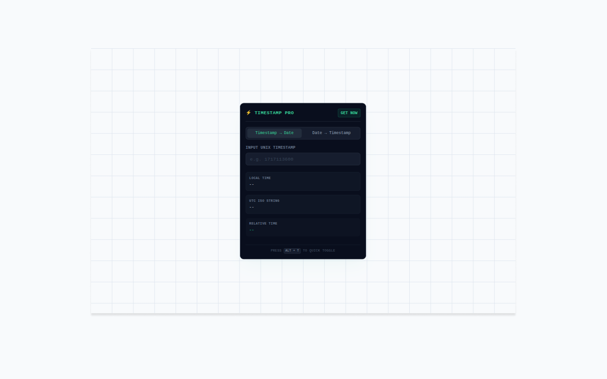

<div align="center">

  

  <h1>Unix Timestamp Converter & Epoch Pro</h1>

  <p>
    <b>A fast, privacy-first Unix timestamp converter built for developers and everyday debugging.</b>
  </p>

  <p></p>

  <div align="center">
    
  </div>

  <p></p>

  <p>
    <a href="https://react.dev/"></a>
    <a href="https://wxt.dev"></a>
    <a href="LICENSE"></a>
  </p>

</div>

---

## 📖 Introduction

**Unix Timestamp Converter & Epoch Pro** is a lightweight browser extension for converting Unix timestamps and human-readable dates directly from your browser.

It automatically detects common Unix timestamp formats and makes it easy to switch between UTC and local time.

Whether you're debugging API responses, inspecting server logs, working with databases, or analyzing JSON data, the extension provides a quick way to understand timestamps without leaving your current workflow.

## ✨ Key Features

* ⚡ **Instant Timestamp Conversion**
  Convert Unix timestamps into readable dates and convert dates back into Unix timestamps.

* 🧠 **Smart 10 / 13-Digit Detection**
  Automatically recognizes 10-digit second-based timestamps and 13-digit millisecond-based timestamps.

* 🌍 **UTC & Local Time**
  Easily view timestamps in UTC or your local timezone.

* 🖱️ **Selection-Based Conversion**
  Select a timestamp directly on a webpage and convert it without manually copying the value.

* 🧩 **Browser Popup**
  Quickly perform conversions from the extension popup whenever you need them.

* 🔢 **Seconds & Milliseconds**
  Supports both common Unix timestamp units without requiring manual unit selection.

* 🚀 **Lightweight & Fast**
  Designed as a focused developer utility with minimal overhead.

## 🎯 Use Cases

Unix Timestamp Converter is particularly useful for:

* 🧑‍💻 Backend development
* 🌐 API debugging
* 📋 JSON inspection
* 🗄️ Database development
* 📜 Server log analysis
* 🔧 DevOps workflows
* 📊 Data analysis
* 🐛 Debugging distributed systems

For example:

```text
1755446400
```

can be instantly interpreted as a human-readable date instead of manually converting the value.

## 🛠 Tech Stack

* **UI Framework:** React
* **Extension Framework:** [WXT](https://wxt.dev/)
* **Browser APIs:** Chrome Extensions APIs
* **Timestamp Processing:** Local JavaScript date and time APIs

## 🚀 Getting Started

### Prerequisites

Make sure you have:

* **Node.js:** `>= 18.0.0`
* **Package Manager:** `pnpm` recommended, or `npm` / `yarn`

### Installation

Clone the repository:

```bash
git clone https://github.com/durban89/unix-timestamp-converter-epoch-pro.git
cd unix-timestamp-converter-epoch-pro
```

Install dependencies:

```bash
pnpm install
```

Start development:

```bash
pnpm dev
```

Build the production extension:

```bash
pnpm build
```

### Load in Chrome

1. Open `chrome://extensions/`
2. Enable **Developer mode**
3. Click **Load unpacked**
4. Select the generated extension directory

## 📁 Project Structure

```text
.
├── assets
├── entrypoints
├── LICENSE
├── package.json
├── package-lock.json
├── public
├── README.md
├── scripts
├── tsconfig.json
├── utils
├── wxt.config.ts
└── yarn.lock
```

> The actual project structure may vary depending on the current implementation.

## 🔒 Privacy

**Unix Timestamp Converter & Epoch Pro is privacy-first.**

Timestamp conversion is performed locally in your browser.

The extension does not need to upload timestamp values to a remote server or rely on an external timestamp conversion API.

It does not require:

* An account
* A remote conversion service
* Uploading timestamp data
* Server-side processing

Your timestamp values stay in your browser.

## 📜 License

Unix Timestamp Converter & Epoch Pro is licensed under the **GNU Affero General Public License v3.0 (AGPL-3.0)**.

See the [LICENSE](LICENSE) file for the complete license text.

## 👨‍💻 About

**Unix Timestamp Converter & Epoch Pro** is an independent developer project focused on building simple, privacy-friendly utilities for developers.

The goal is simple:

> **Make everyday developer tasks faster and easier.**

## ⭐ Support

If you find the extension useful, consider giving the repository a ⭐ on GitHub.

Bug reports, feature requests, and contributions are welcome.

---

**Built independently. Built for developers. Privacy first.**
